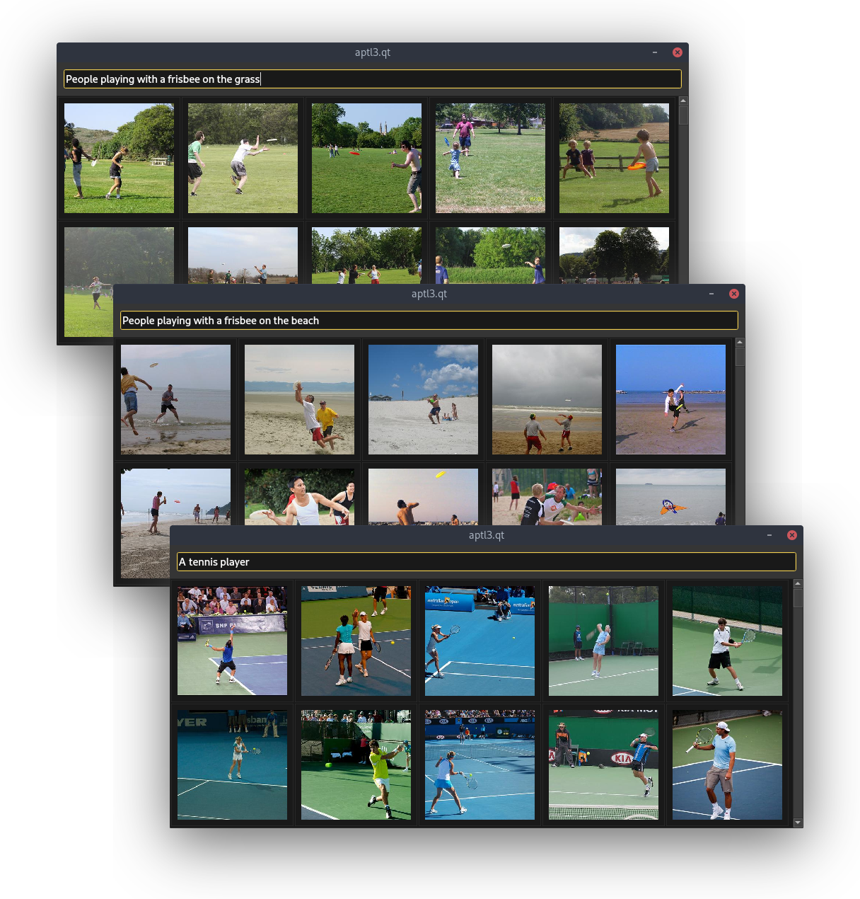

aptl3
=====

This is a library and a Qt desktop application whose goal is to search and explore a private collection of media,
using a technique called Generalized Procrustes analysis, applied on neural embeddings extracted by pretrained models already available on the net.

The idea is to ease the management of a large multimedia collection by letting the machine use its own language to understand
the contents of files and annotations, and then give the user an intuitive interface to interrogate such a machine.

This repository is a Proof of Concept brought closer to "production" as a desktop application for data scales ranging from
personal use to small groups (e.g. a family) sharing a multimedia archive of memories, like a million of photographs.
The internal working is based on several other open-source projects,
including PyTorch and Tensorflow models for feature extraction and [Annoy](https://github.com/spotify/annoy) for the indexing of embedding data.
A tool to load the [COCO dataset](https://cocodataset.org/) (images with captions) is also included for the purpose of training an initial alignment model.
I'm planning to publish the pretrained alignment models required to try cross-modal retrieval out-of-the-box, 
for any small amount of files available for user trials.

### Key features and dependencies

- multi-modal feature vector extraction via pretrained models (torch, tf)
- cross-modal retrieval via procrustean embedding translation (sci-py)
- fast approximate nearest neighbors search engine (Annoy)
- zero-configuration embedded DB for millions of items (sqlite3)
- thumbnail extractors for many media formats (Pillow, currently images only)
- easy to use, cross-platform desktop app with intuitive GUI (PyQt5)
- extensible software architecture to integrate the whole thing

### Performance and scalability

The "ingestion" of a media collection is a long computational task that involves the evaluation of feature extraction models.
This software is designed to work incrementally, with fault tolerance and to properly exploit GPUs and multicore parallelism
in order to complete the ingestion as fast as possible on a single machine,
starting from an approximate throughput of 2 photos/second on a laptop with 4GB of RAM and a dual-core Intel i3 CPU from 2016.
Indexing of large amounts of embedding data is supported using memory-mapped files that do not need to fit in memory.

In order to scale up from that, the use of multiple machines accessing a shared collection requires manual coordination to avoid duplicated computations.
Merging the resulting databases is also an operation that is still not supported by this application,
even if the data model does not pose any issue for that and will allow for a rather easy implementation of such operation.

The interrogation (e.g. search by a text query) is instead a fast operation with a logarithmic complexity w.r.t. the size of your media collection.
In conclusion, the scalability of the media collection is currently limited to what the CPUs and GPUs of a single machine can process for the first ingestion in practical times.

### Quality evaluation

In order to assess the quality of the content retrieval functionality,
the underlying models used by the application can be evaluated in terms of Recall@K, i.e. the fraction of times you find an exact match, 
with K being the number of results that you are willing to be displayed.
A dataset of captioned images or other aligned media is needed.

A draft evaluation with a subset of 16384 captioned images of the COCO dataset gave a recall higher than 75% with K=100.
That translates into scrolling two screens of thumbnails
before finding in 75% of cases an image that in the COCO dataset has a caption exactly equal to the search query,
but it often happened that almost all the first results were reasonably pertinent.
These are grounds to say the procrustes alignment technique is good for this application, as simple as it is.
So far, no evaluation has been done with more accurate feature extraction models (e.g. efficientnet/b1-7 instead of b0).
An exhaustive evaluation tool, still not part of this repository, will allow to quantify the possibility to improve the search engine.

